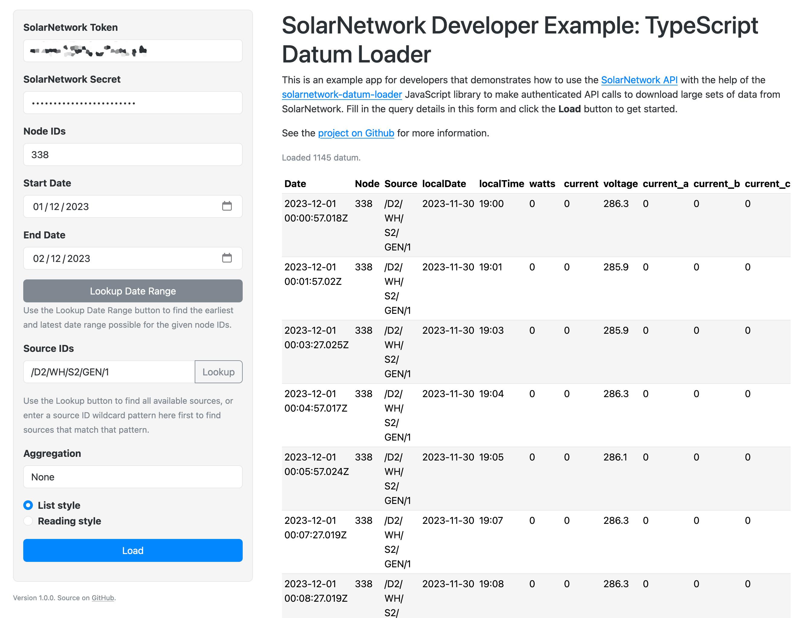

# SolarNetwork Example: TypeScript Datum Loader

This project is a little web app to show the basics of using the SolarNetwork API
in a TypeScript project to download large sets of datum stream data using the `DatumLoader` helper class.

You can see the example in action here:

<https://go.solarnetwork.net/dev/example/typescript-datum-loader/>



# Key aspects

There are a few key aspects of this example worth pointing out.

## SolarNetwork API

The [solarnetwork-datum-loader][sn-datum-loader] package is [included in the project][sn-datum-loader-dep], which provides many helpful utilities in both TypeScript and JavaScript for working with the SolarNetwork API.

```json
{
	"dependencies": {
		"solarnetwork-datum-loader": "^2.0.0"
	}
}
```

## Token authentication with Fetch API

The example demonstrates using [SolarNetwork token authentication][sn-api-auth] with the browser [Fetch API][fetch].

First the demo [imports the AuthorizationV2Builder][import-sn-auth] class and [creates a reusable instance][auth-instance] in an `auth` variable:

```ts
import { AuthorizationV2Builder } from "solarnetwork-api-core/lib/net";

const auth = new AuthorizationV2Builder();
```

A `change` form event handler listens for changes to the form's token and secret fields, and [saves the credentials][save-creds] for future API calls:

```ts
// save credentials
auth.tokenId = settingsForm.snToken.value;
auth.saveSigningKey(settingsForm.snTokenSecret.value);
```

# Building from source

To build yourself, clone or download this repository. You need to have
Node 16+ installed. Then:

```sh
# initialize dependencies
npm ci

# run development live server on http://localhost:8080
npm run dev

# build for production
npm run build
```

Running the `build` script will generate the application into the `dist/` directory.

[auth-instance]: https://github.com/SolarNetwork/solarnetwork-example/blob/1.4.0/TypeScript/datum-loader/src/main/ts/sn.ts#L19
[fetch]: https://developer.mozilla.org/en-US/docs/Web/API/Fetch_API
[sn-api-auth]: https://github.com/SolarNetwork/solarnetwork/wiki/SolarNet-API-authentication-scheme-V2
[sn-datum-loader]: https://www.npmjs.com/package/solarnetwork-datum-loader
[sn-datum-loader-dep]: https://github.com/SolarNetwork/solarnetwork-example/blob/1.4.0/TypeScript/datum-loader/package.json#L43
[import-sn-auth]: https://github.com/SolarNetwork/solarnetwork-example/blob/1.4.0/TypeScript/datum-loader/src/main/ts/sn.ts#L2-L5
[save-creds]: https://github.com/SolarNetwork/solarnetwork-example/blob/1.4.0/TypeScript/datum-loader/src/main/ts/sn.ts#L26-L35
